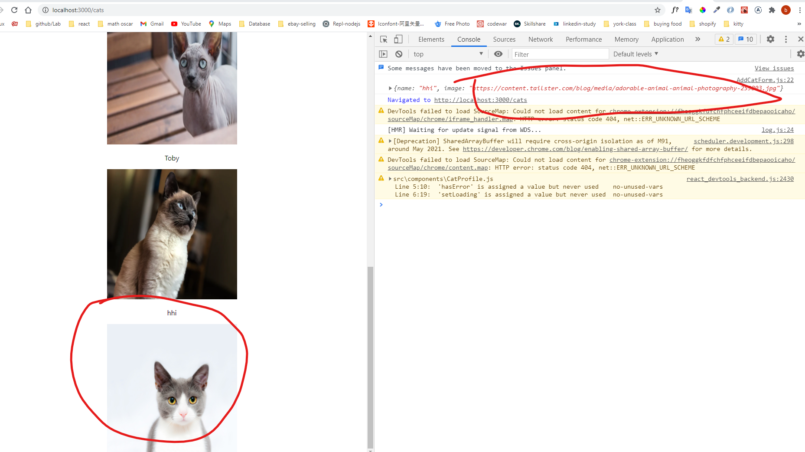
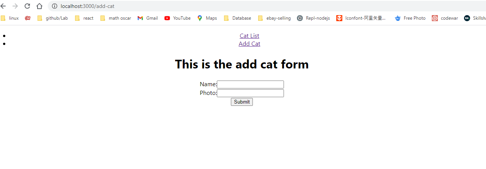

### FS1030 cat cafe lab react express mysql connection, can get data from mysql and post data from addcatform page

2021-2-17

once download this repo, please download cat-cafe-client repo as well. Include to this cat-cafe-connect-mysql folder. Then run

```
npm start
```

frontend and backend will connect and work together.
Frontend run at port 3000 and backend run at 3001.




